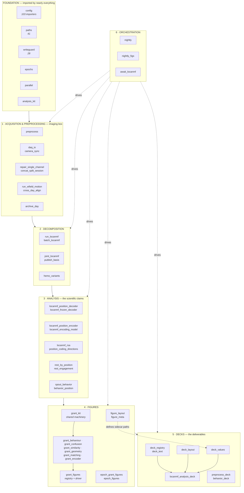

# Architecture — what the code is, in layers, and where each part is used

`wfield_local/` holds **162 modules**, **109 of them runnable** with `python -m wfield_local.<name>`.
That is a lot of entry points for one package, and it is deliberate: this repo grew as an analysis
notebook that learned to be a pipeline, and nearly every question anyone asked became a module that
could be run on its own and would print its answer. The cost is that the tree does not tell you
where to start. This document does.

**It is the map, not the procedure.** For what to run on a given night, see
[`runbooks/`](../runbooks); for a first run from nothing, see
[`runbooks/first_full_analysis.md`](../runbooks/first_full_analysis.md). For *why* something is the
way it is — nearly always because the alternative was tried and failed — see
[`DECISIONS.md`](../DECISIONS.md).

---

## The shape of it



Solid arrows are *data* flowing forward: each stage reads what the one before it wrote. Dotted
arrows are *control* — `nightly` and `nightly_figs` invoke stages rather than being imported by
them. The two dotted arrows into `deck_values` and `grant_figures` mark the seams that have caused
the most trouble, and both are explained below.

---

## The layers, and what each one owns

### Foundation

| module | what it owns |
|---|---|
| [`config`](../wfield_local/config.py) | the session registry, curated date sets, animal lists, `defaults.yaml`. **103 modules import it.** Anything that hardcodes a session list instead of asking `config` is a bug waiting to go stale. |
| [`paths`](../wfield_local/paths.py) | every root, per machine. There are four machines (`analysis`, `imaging`, `mac`, `analysis_desktop`) and they mount the same shares at different letters. Hardcoding a path is how the same bug appeared in `BEH_ROOT`, `DEFAULT_OUT` and the session cache. |
| [`writeguard`](../wfield_local/writeguard.py) | refuses writes outside Priya's subtree on MICROSCOPE. Ground rules 0/1. |
| [`epochs`](../wfield_local/epochs.py) | pre / acute / subacute / chronic, per animal, counted from that animal's own lesion date. `chronic_from` is DERIVED from behaviour each run and published to `epoch_boundaries.json`. |
| [`parallel`](../wfield_local/parallel.py) | `fan_out` over processes. Ground rule 6: per-session loops fan out. Two traps it exists to prevent — collect in sorted order, and options travel in the ITEM, because spawn does not inherit globals. |
| [`analysis_kit`](../wfield_local/analysis_kit.py) | the shared bootstrap and session-selection helpers. `boot_ci` is flat-pool for LEVELS, `boot_delta` is animal-weighted for CHANGES, and confusing the two is what retracted a published number. |

### 1 · Acquisition and preprocessing

Runs on the imaging box against local raw. Writes motion-corrected data and per-session QC under
`labcams/<date>/<session>/`. Raw movies (`.dat`, `.bin`) are archived to the **standby** server,
not kept on MICROSCOPE — see [`archive_day`](../wfield_local/archive_day.py).

### 2 · Decomposition

LocaNMF, on the GPU box. `joint_locanmf` fits one basis across an animal's sessions and FREEZES it,
so later days are projected rather than refitted — which is what makes a cross-day comparison a
claim about cortex rather than about the parcellation.

### 3 · Analysis

Where the scientific claims are made. The convention throughout: a figure's numbers are also
written to a CSV beside it, because *a figure whose values exist nowhere else drifts from every
text that quotes it and nothing can notice.*

### 4 · Figures

The grant renderer was **6,599 lines in one file** until 2026-09-21. It is now eight modules, and
the division is from the call graph rather than from the names: every function in a family module
is reached from that family's entry points and from no other.

| module | lines | what it draws |
|---|---:|---|
| [`grant_figures`](../wfield_local/grant_figures.py) | 1,271 | **registry and driver only** — `JOBS`, the unit decomposition, the process pool, the CLI |
| [`grant_kit`](../wfield_local/grant_kit.py) | 1,428 | shared machinery: layout, saving, seeding, caching, labels |
| [`grant_geometry`](../wfield_local/grant_geometry.py) | 1,241 | crossnobis, asymmetry, position structure, recovery trajectory |
| [`grant_similarity`](../wfield_local/grant_similarity.py) | 1,090 | pattern similarity and split-half reliability |
| [`grant_confusion`](../wfield_local/grant_confusion.py) | 878 | the confusion families |
| [`grant_encoder`](../wfield_local/grant_encoder.py) | 713 | gain versus shape, coding retained, frozen vs within |
| [`grant_matching`](../wfield_local/grant_matching.py) | 361 | best-match destination |
| [`grant_behaviour`](../wfield_local/grant_behaviour.py) | 347 | licking accuracy, pre-stroke decoding |

Rendered in parallel, one process per `(figure, alignment, trial class)` unit. **76 names are
re-exported on `grant_figures`** because 31 of them are addressed from outside these modules —
`epoch_grant_figures` and `epoch_figures` import a dozen between them.

[`epoch_grant_figures`](../wfield_local/epoch_grant_figures.py) (3,942 lines) and
[`epoch_figures`](../wfield_local/epoch_figures.py) render the pooled per-epoch set the deck
places as Section I. They are the same shape as the grant renderer was and have not been split.

[`figure_layout`](../wfield_local/figure_layout.py) is **the one definition of where a figure's
companion files go**: `<name>.png`, `svg/<name>.svg`, `data/<name>.csv`. Every writer goes through
it. A writer that builds its own path puts a file back in the flat directory and nothing will
report it.

### 5 · Decks

The analysis deck is four modules: [`deck_registry`](../wfield_local/deck_registry.py) (what
figures exist, as data), [`deck_text`](../wfield_local/deck_text.py) (the prose),
[`deck_layout`](../wfield_local/deck_layout.py) (`SlideCanvas`, the drawing surface), and
[`locanmf_analysis_deck`](../wfield_local/locanmf_analysis_deck.py) (orchestration and the
publication gates).

[`deck_values`](../wfield_local/deck_values.py) resolves `{{...}}` tokens in speaker notes against
the sidecar CSVs, so a number quoted in prose comes from the same file the figure was drawn from.

### 6 · Orchestration

`nightly` → `nightly_figs` → `await_locanmf`. **"If it is part of the deck it is part of the
nightly"**: a deck input that no nightly step regenerates is frozen at the day someone last made it
by hand.

---

## Three seams that keep causing bugs

Every one of these has bitten more than once. They are properties of the *shape* of the code, so
they will bite again in a new place.

**1 · A check that reads code by path goes blind when the code moves.** Guards here are often
source-level, because the failures they catch are silent ones that no assertion on a value would
see. When `locanmf_analysis_deck` became four modules, five tests and two audit scripts kept
passing over the fragment left behind — the claim audit silently fell from 332 notes to 132, and
the figure-coverage scrape from 208 patterns to 80. The fix is one list, not seven: `DECK_MODULES`
and `GRANT_MODULES` in [`tests/conftest.py`](../tests/conftest.py). **When you split a module, grep
for anything that opens it by name.**

**2 · Nothing survives a module boundary by itself — not state, and not name resolution.** Three
forms of this, all silent:

- A global assigned in one module and read in another is **two variables**. `_ONLY_WINDOW` /
  `_ONLY_VARIANT` gate which alignment a worker renders; moving the readers into `grant_kit` while
  the writers stayed would have made every worker render every alignment — wrong output, three
  times slower, no error. They go through `grant_kit.set_only()` now.
- **A function resolves a global in the module where it was DEFINED**, so `monkeypatch.setattr` on
  a re-export lands nowhere. `test_rdm_ci` patched `grant_figures._collect_7`; `_rdm_ci` had moved
  to `grant_geometry` and went on calling the real collector, which hung the suite for sixteen
  minutes of CPU. It could as easily have passed while exercising nothing. Use `patch_grant` in
  `tests/conftest.py`, which patches every module that has the name and refuses when none does.
- Re-exporting a name keeps `hasattr` true and **does not** fix either of the above.

This is ground rule 6's "options travel in the ITEM because spawn does not inherit globals",
arriving from three different directions.

**3 · A verification tool that cannot fail is decoration.** Five times now a check has reported
success having measured nothing: two empty fingerprint files comparing equal, and an SVG comparison
run against an unset shell variable reporting `identical=0 differing=0`. Both now refuse an empty
measurement. Relatedly, **matplotlib SVG is not byte-reproducible** — every file carries a render
timestamp and random element ids — so byte-comparing SVGs reports a difference whatever you did.
Use [`scripts/compare_svg_renders.py`](../scripts/compare_svg_renders.py).

**4 · A writer and its reader must be moved together, and a round trip will not prove it.**
`figure_layout` moved sidecars into `data/` and `find_sidecar` with them, but six writers in
`scripts/rest_migration` and `matrix_bootstrap` kept building the flat path; for a day the
fresh numbers landed where nothing looked while every reader resolved a two-day-old copy,
both files present, nothing raising. A writer/reader round-trip test does **not** catch it —
the read-side fallback finds whatever the writer just wrote, so the pair agrees while both
are wrong. Assert the *location* as well as the round trip, and see
[`scripts/check_figure_layout.py`](../scripts/check_figure_layout.py) for the on-disk check.

---

## How a refactor is verified here

Numbers are the test. The suite does not cover the analysis scripts, and it is not meant to.

| what changed | how it is proved |
|---|---|
| deck structure | [`scripts/deck_fingerprint.py`](../scripts/deck_fingerprint.py) — one line per shape, with resolved speaker notes. Byte-comparing a `.pptx` is useless (zip timestamps) and slide count is far too coarse. |
| figure renderers | render before and after, byte-compare the PNGs. Use `--output` to a scratch directory, never the share. |
| pure functions | pin them: check a frozen copy of the pre-extraction source into a test and assert EXACT equality of the draws. Milliseconds instead of hours, and stronger. |
| module constants | hash every one before and after and compare exactly. Covers constants no particular run reaches. |
| where artefacts LAND | [`scripts/check_figure_layout.py`](../scripts/check_figure_layout.py) — scans the output tree for sidecars sitting flat beside a figure. Empirical, because a source scan cannot see a file a third-party script dropped there. `--fix` repairs, move-only. |

Two rules learned the hard way, both of which have already caught real bugs:

- **Run the baseline twice before trusting it.** A before/after comparison against a baseline you
  have not shown to be reproducible is meaningless. `rest_coupling --from-csv` disagreed with
  itself between two runs of identical code and hid a real bug for an hour.
- **Mutation-test the check.** Before trusting the deck fingerprint, two deliberate defects were
  introduced to confirm it noticed: swapping two registry entries moved 60 lines, a three-character
  typo in one speaker note moved 2.

---

## Where the output goes

```
labcams/
  <date>/<session>/          per-session preprocessing + QC
  grant_figures/             the summary set   ·  svg/  data/
    epoch/                   the pooled epoch set  ·  svg/  data/  retired/
  analysis_figures/          the nightly mirror of every analysis figure  ·  json/
  channel_comparison/        415-vs-470 channel-identity diagnostics
  retired/                   superseded output, never deleted
  frozen_models/ joint_bases/ xday/ deck_history/ snapshots/
  spout_position_analysis_summary.pptx   + .manifest.json
```

`retired/` is the convention for anything superseded: nothing on MICROSCOPE is deleted (ground
rules 0/1), it moves to a `retired/<reason>/` directory with a README saying why.
